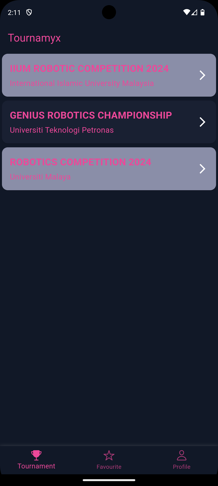
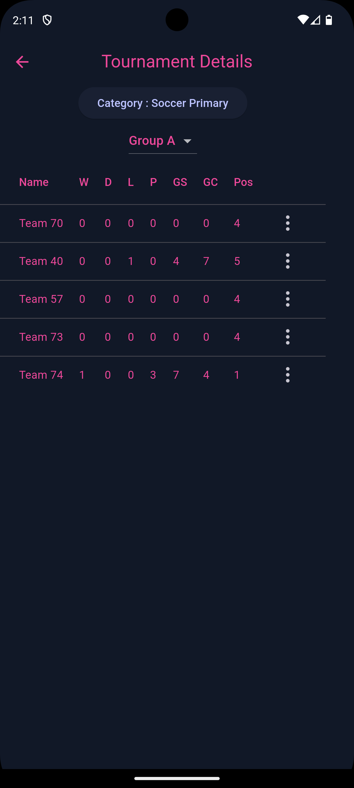
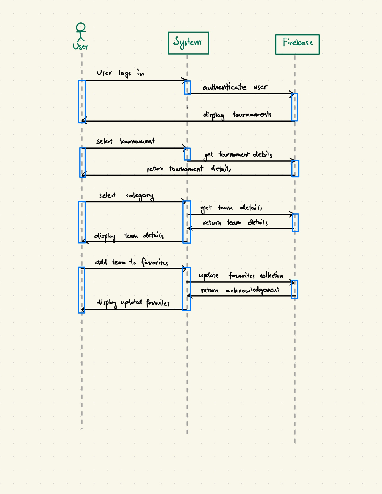
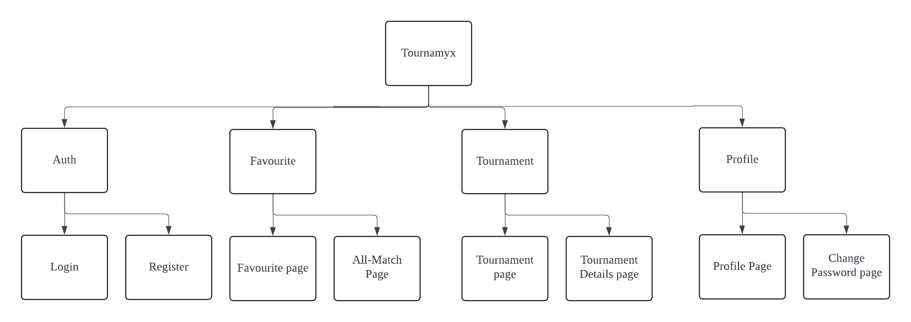
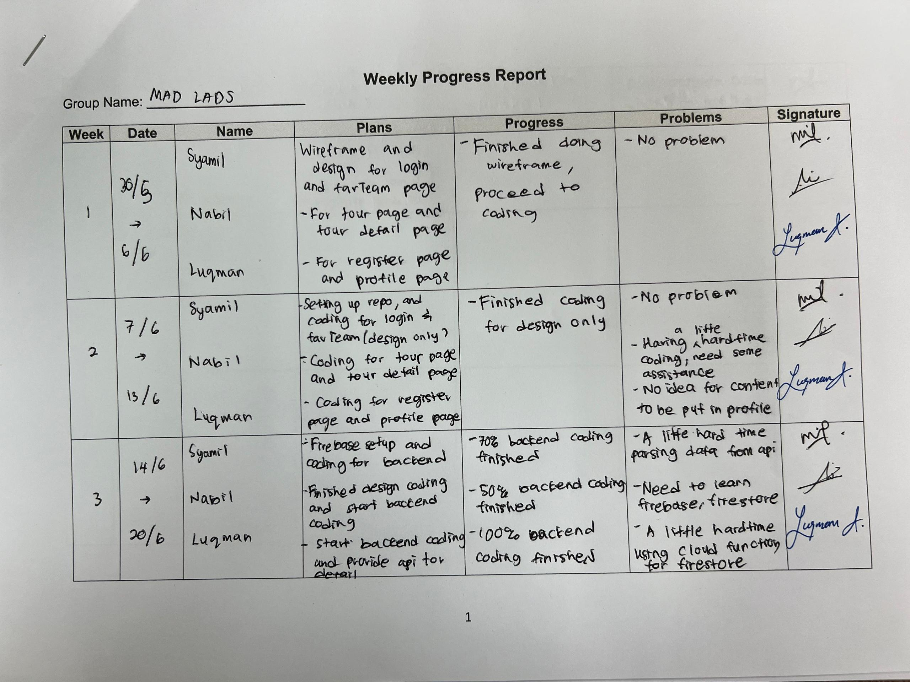
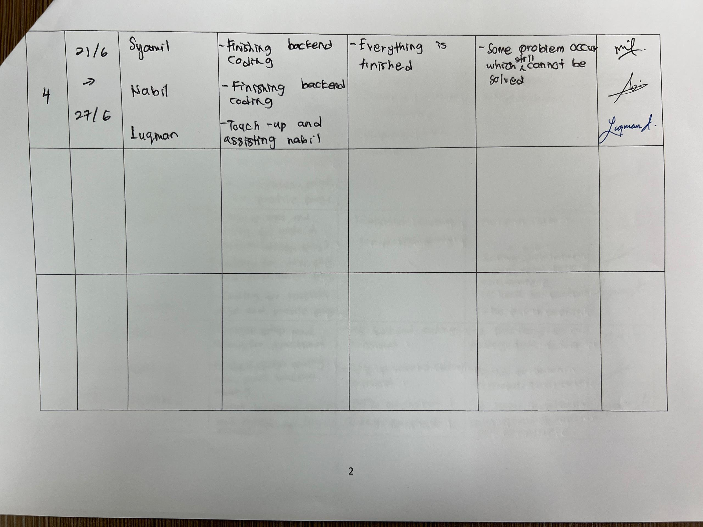

# tournamyx_mobile

## MAD LADS
| Name     | Matric No           | Tasks  |
| :------------- |:-------------| :-----|
| Wan Muhammad Syamil bin W Mohd Yusof| 2220561 | login page, favourite team page, setup firebase, setup repository |
| Luqman Alhakim bin Malik Arman |2211145| registration page, profile page, api setup and calling, favoriting team feature |
| Nabil bin Muhd Nordin | 2210859 | navigation bar, tournament page, tournament detail page, firestore docs and collection setup |

## Group Project : Tournamyx Mobile
Tournamyx Mobile is a application designed for participants and spectators of robotic competitions(our current focus is IIUM Robotic Competition). This mobile app brings the excitement of robotic tournaments to users fingertips, offering a comprehensive suite of features to enhance competition experience. Main features of this mobile app is fixture and schedule, tournament standings, live updates and favourite teams.

### Objective
1. Enhancing user experience
2. Improve ingormation acceessibility
3. Facilitate competition management

### Features and functionalities
1. Firebase authentication
2. ⁠Change password
3. ⁠⁠Display all tournaments
4. ⁠⁠Select categories
5. ⁠⁠Display scores for teams by group in table view
6. ⁠⁠Add team to favorite

### Screen Navigation and Widgets Implementation
- Screen Navigation:
  - Authentication:
    - Login page
        
      
  
    - Register page
  
      
  
  - Favourite:
    - Favourite page
     
    
    
    - All Match page

  - Profile:
    - Profile page
     
    
    
    - Change password page
     
    
    

  - Tournament:
    - Tournament page
      - This page displays the list of the tournaments that are currently held and will be held.
      - We plan in the future to so the user will add their own tournament.
      - In the card there's an arrow that will be redirected to the Tournaments Details Page.
      - The page is as follows:
          
     
         

    - Tournament Details page
      - This page will display the table for categories
      
    
      
- Widgets Implementation:
  - General use:
    - Top App Bar
    - Bottom Navigation Bar
    - Loading screen
   
  - Favourite page:
    - Table to view all matches from your favourite team

  - Profile page:
    - Button to change password and sign out
   
  - Tournament page:
    - Categories dialog button
    - Table for both primary and secondary
    - Tournament Card

### Sequence Diagram

### References
1. https://docs.flutter.dev/
2. https://firebase.google.com/
3. https://ionic.io/ionicons
4. https://pub.dev/packages/http
5. https://chatgpt.com/

## Weekly Progress Report

